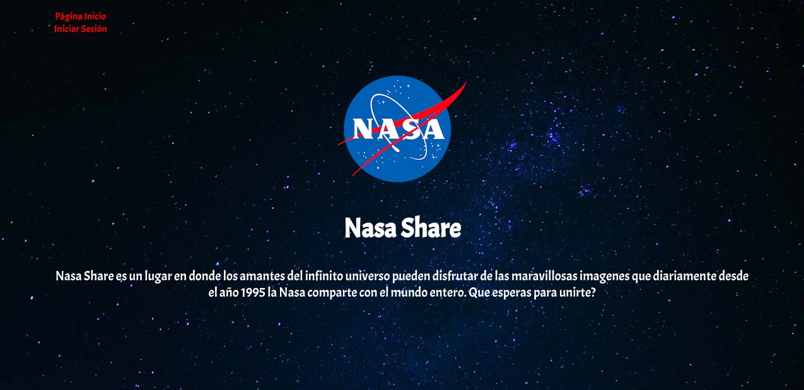
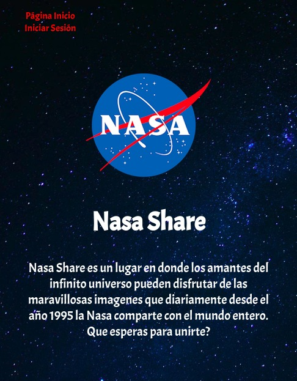
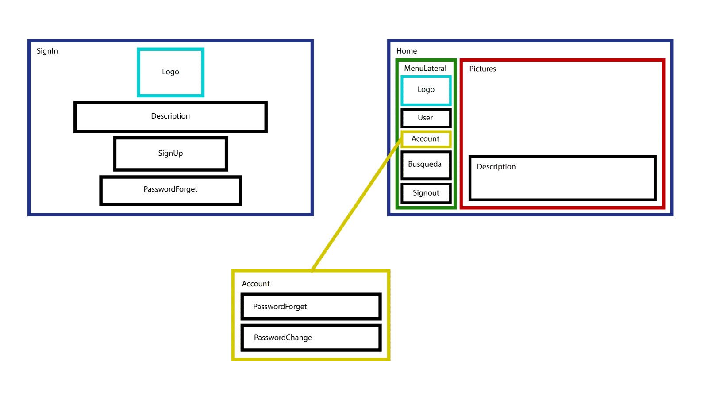

## Nasa Share 

Nasa Share es un lugar en donde los amantes del infinito universo pueden disfrutar de las maravillosas imagenes que diariamente desde el año 1995 la Nasa comparte con el mundo entero. 

Para hacer esto posible se utilizó la Api que proporciona la Nasa en su [*página web*](https://api.nasa.gov/index.html).

Cuenta con versión móvil y escritorio.

#### Ejemplo de Versión web

#### Ejemplo de Versión móvil

Para realizar el proyecto se utilizaron las siguientes herramientas:

* api.NASA
* Reactjs
* Firebase
* Babel
* Flexbox grid
* Node js

#### React

Se crea el entorno de desarrollo ingresando por la terminal el comando `npm install -g create-react-app`. 

Luego `create-react-app nombre_proyecto` para crear la carpeta con las configuraciones, gestores de paquetes, de tareas, transpiladores, linters, builders etc. que son necesarias para desarrollar el proyeccto.

A continuación se escribe el comando `cd nombre_proyecto` para ingresar a la carpeta, para verlo en pantalla se ingresa el comando `npm start`, así se abre en el servidor web localhost:3000.

##### Componentes

A continuación se muestra un esquema con los distintos componentes que posee el proyecto.

Autoras
-------
 
[*Carol Sepúlveda*](https://github.com/carol-solivos) & [*Vanessa Martínez*](https://github.com/vanemarnava)